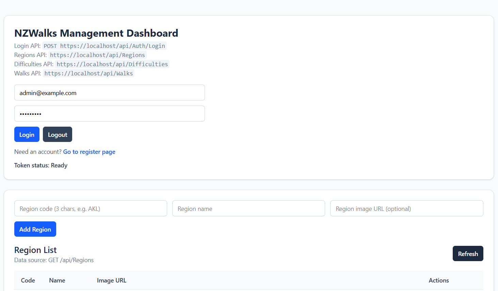
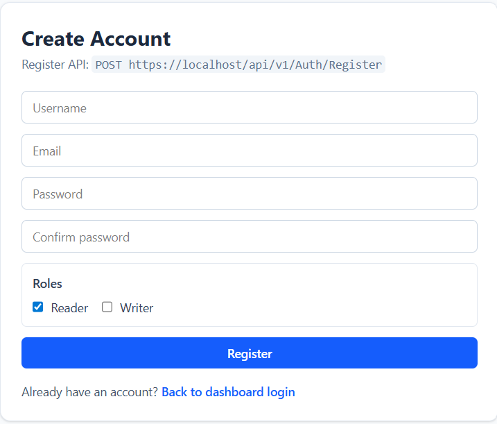
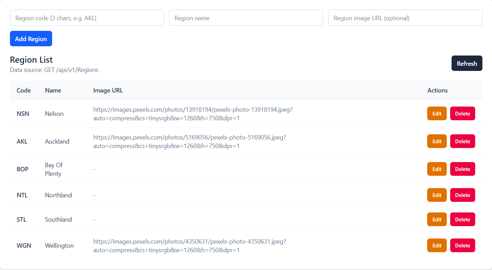
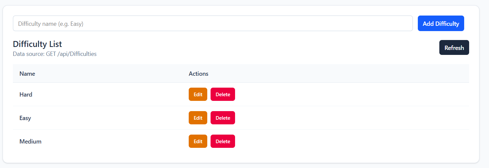
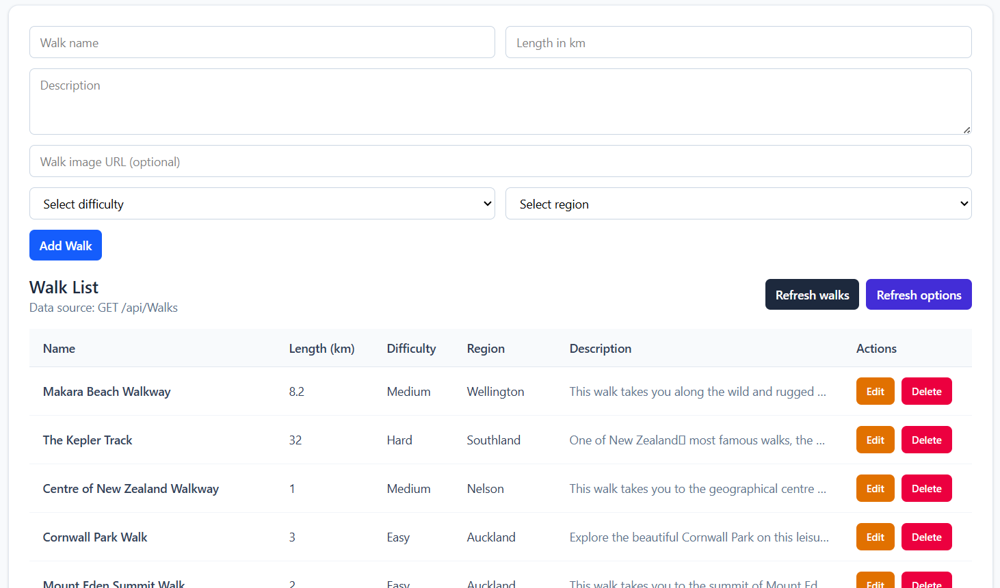

# NZWalks

ASP.NET Core Web API + React (Vite + TypeScript) full-stack project for managing NZ regions, walk difficulties, and walks.

## Project Structure

- `api/NZWalks.API` - ASP.NET Core backend (JWT auth, role-based authorization)
- `frontend/nz-walks-ui` - React frontend (Tailwind CSS + Axios + CRUD dashboard)
- `conf/nginx` - Nginx reverse proxy config
- `docker-compose.yml` - Multi-container local deployment (nginx + api + mssql)
- `logs/` - Runtime logs for API, Nginx, and MSSQL

## Features

- JWT Login/Register (`/api/Auth/Login`, `/api/Auth/Register`)
- Role-based API access (`Reader`, `Writer`, `Admin`)
- CRUD UI for:
  - Regions
  - Difficulties
  - Walks
- Toast notifications and loading skeletons
- Route-based frontend pages:
  - Dashboard (`/`)
  - Register (`/register`)

## Local Development

### 1) Run Backend API

From `api/NZWalks.API`:

```bash
dotnet run --launch-profile https
```

Default local endpoints from `launchSettings.json`:

- `https://localhost:7238`
- `http://localhost:5017`

Swagger:

- `https://localhost:7238/swagger`

### 2) Run Frontend

From `frontend/nz-walks-ui`:

```bash
npm install
npm run dev
```

Open:

- `http://localhost:5173`

## Frontend API Configuration

Frontend Axios default base URL:

- `https://localhost/api`

This is configured in:

- `frontend/nz-walks-ui/src/services/apiClient.ts`

If needed, you can override with `VITE_API_BASE_URL`.

## Docker Deployment

Root `docker-compose.yml` defines:

- `reverse_proxy` (Nginx)
- `api` (ASP.NET Core)
- `mssql` (SQL Server)

Run:

```bash
docker compose up -d --build
```

Note: compose uses many values from env variables (`ENV_FILE_PATH`, ports, image tags, etc.). Ensure your env file is prepared before startup.

## Authorization Notes

- `Regions` and `Difficulties` read endpoints require `Reader` or `Admin`.
- If dropdown options are empty in walk form, check:
  - user is logged in
  - JWT token exists in browser local storage
  - account has correct roles

## Useful Paths

- Backend entry: `api/NZWalks.API/Program.cs`
- Frontend dashboard: `frontend/nz-walks-ui/src/pages/Dashboard.tsx`
- Frontend register page: `frontend/nz-walks-ui/src/pages/RegisterPage.tsx`

## Showcase

> Update the image paths below with your actual files.

### Dashboard



### Register Page



### Region Management



### Difficulty Management



### Walk Management


